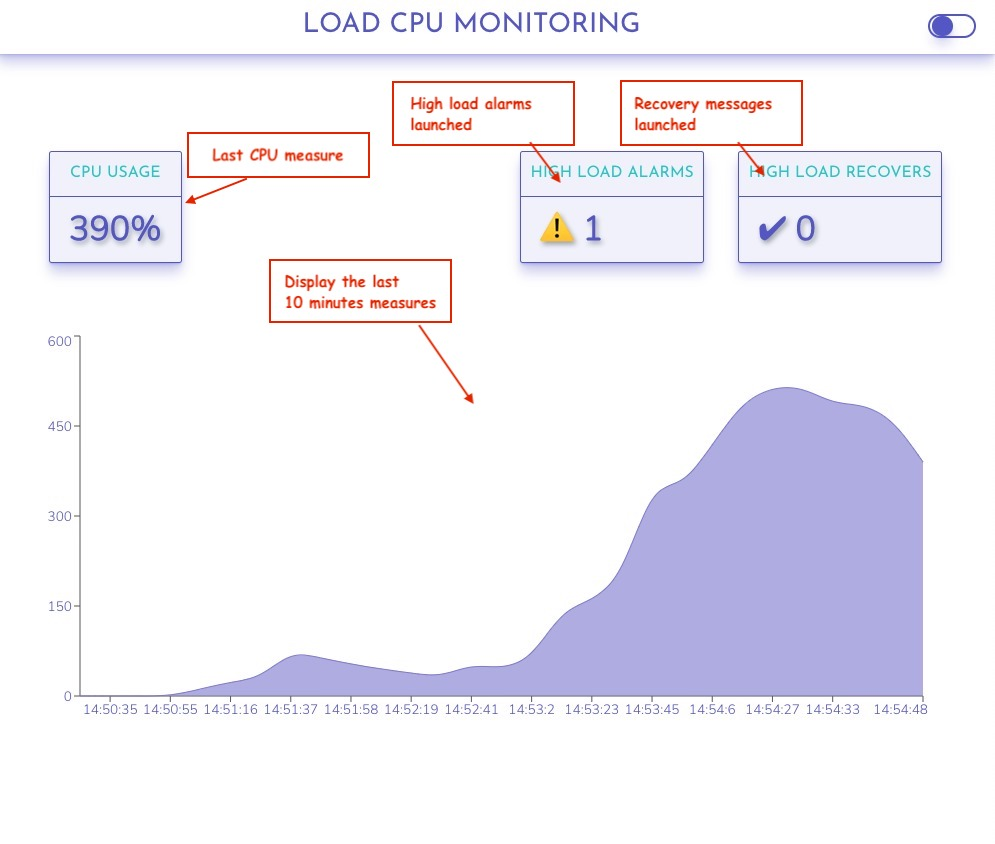

# Load Monitoring Web Application

## 📝 Description

[](#description)

A user should be able to view your application to answer the following questions about their computer:

- What is my computer's current average CPU load?
- How did the average CPU load change over a 10 minute window?
- Has my computer been under heavy CPU load for 2 minutes or more? When? How many times?
- Has my computer recovered from heavy CPU load? When? How many times?



## 💾 Installation

[](#installation)

- ### :whale: Install Docker & Docker Compose

  [Install Docker Locally](https://docs.docker.com/get-docker/)
  [Docker compose install](https://docs.docker.com/compose/install/)

- ### :wrench: Build and run container

  To launch the environment you just need to run docker-compose in the root project

  ```bash
  docker-compose up
  ```

  The command will launch the server and api services.

  Alternative you can run each environment by its own running:

  ```bash
  npm run dev
  ```

  In each one.

## 📐 Architecture Decisions

[](#aproach)

- ### API

  I've decided to use [Fastify]([https://www.fastify.io/) framework for the API of the application. I had never used and I wanted to give it a chance instead of express it as it was a very simple endpoint.

  I've used a common MVC architecture that will allow us to easily grows the API, adding a DDDBB or adding more endpoints.
  In a real-world application, it would be needed to add some kind of monitoring and error watching. Probably something like Sentry or Datadog.

- ### Client

  The client is a [React](https://reactjs.org/) based application. I've used [Vite](https://vitejs.dev/) as an Application builder.

  The structure of the application is a very common folder scaffolding, having a `components` folder for the presentational components and a `features` folder where we have the business logic.

  The state of the application, as is a very simple one, it's held in a `GlobalContext` component.
  This decision for the state is not maybe the best one in a real world example, but it's the best excuse to show a very detailed pattern to handle the state and it makes me very careful with the r-renders of the components, so I can show my understanding of the react internal renderings using React.`React.memo` and `useCallback` in the cases where it's necessary.

  I'm using also a [useEncapsulation](https://kyleshevlin.com/use-encapsulation) pattern in every component it has some logic. It's a pattern that I liked and allows me to have a separation between logic and UI, and in case, it's very useful for testing.

- ### CSS

  I decided to use vanilla CSS for styles the app. Besides I am more used to working with styled-components, I think I could show a better knowledge using the last CSS features. All the CSS depends hugely on custom properties. Allowing us to have 2 completely different themes with only a few properties. It also allows having a very easy cool responsive.

- ### State and Logic

  To accomplish the requirements of the test, I'm using a principal queue, called `cpuMeasures` where all new measures are saved. As we only need to have a saving of the last 10 minutes, when the queue is filled, we remove the first element before inserting a new one. Every time a new measure is added, we check the queue in the last 12 elements (2 minutes) to check if we have to fire an alarm. We could improve that logic using a counter variable, but it will make the logic more complex to follow and the performance improvement is not profitable.

  To fetch data and handle fetching logic I'm using [React query](https://react-query.tanstack.com/). It's a library that I love and it comes perfect for the fetching interval functionality. Another way to do it could have been using a custom setInterval function or, even, we could have created a webWorker so we could fetch the data in another thread.

## 🧪 Testing

[](#testing)

I've decided to use [testing-library](https://testing-library.com/) with [MSW](https://mswjs.io/) for testing.
This two libraries allowing us to have a very real integration test for react.

To launch the test you need to be in the `client/` folder and run:

```bash
  npm run test
```

## 🔜 Future Implementations

[](#cud)

- I wanted to add storybook to have a small system design view of the UI components. But the testing takes me longer I though.
- I would like to add more testing. Add E2E tests with cypress would be cool.
- I would like to add a react custom hook to save data in the local storage and save the user theme selection
- It would be great to add a custom hook to show notifications in the tab title so we could notice a new alarm had been fired even when the user is not in the application tab.

</details>
